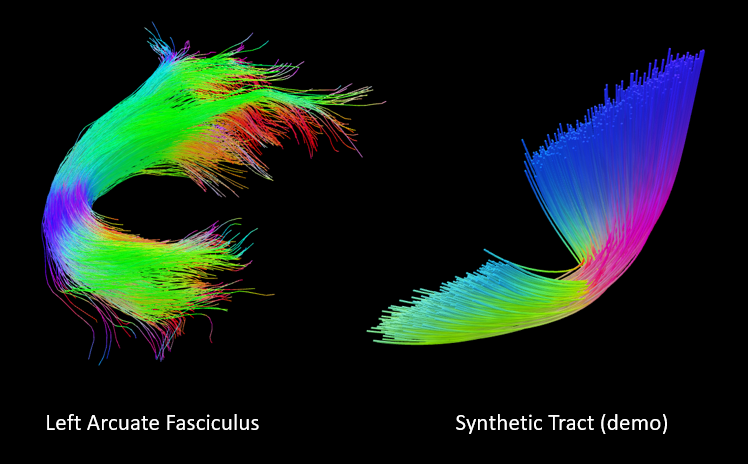

# tract2mesh

Convert tracts into meshes using a simple MATLAB script. 
Import interactive mesh objects into PowerPoint presentations or share with colleagues on Teams.
Suggestions and advice for improvement welcome.



Screenshot of meshed tracts in PowerPoint.

## Inputs

Main inputs: 

- **streamlines**: cell array with each cell representing one streamline and containing a Nx3 matrix of streamline vertex coordinates. If not provided, a synthetic tract will be generated (useful for testing).
- **radius**: desired radius of 3D streamlines. Default: 0.1
- **vertrices**: number of mesh vertices at cross-section. Higher numbers will make streamlines more rounded whilst increasing output size. Default: 6
- **centre**: places the middle of the tract at the origin of the coordinate space. Default: true
- **colours**: choose a colouring scheme produced. If not chosen, returns mesh vertex indices corresponding to individual streamlines. Options: 
  - DEC (for direction encoded colouring)
  - random (for random colour allocation per individual streamline)
  - Nx3 matrix of chosen colours where N is the number of streamlines and columns represent R,G,B

Inputs for synthetic tract generation:

- **nsl**: number of streamlines. Default: random 1-1000
- **step_size**: distance between streamline vertices. Default: 1

Arguments are provided in a standard MATLAB Name-Value pair fashion.

## Outputs

- **V**: mesh vertex coordinates
- **F**: mesh face connectivity
- **C**: mesh colour scheme, with rows representing individual vertices and columns representing R,G,B. If colours input not provided, returns indices of individual streamlines instead.

## Example
```
% load streamlines from a .tck file
tck = read_mrtrix_tracts('tract.tck');
streamlines = tck.data;

% convert
[V, F, C] = tract2mesh('streamlines', streamlines, 'radius', 0.3, 'vertices', 7, 'centre', false, 'colours', 'DEC');
```
## External resources

- **Getting tracts into MATLAB**: depends on the format. [MRtrix](https://www.mrtrix.org) comes with the MATLAB script (read_mrtrix_tracks) for reading .tck format.
- **Saving mesh objects**: down to user, one example that seems to work well with MS Office is [write3mf](https://uk.mathworks.com/matlabcentral/fileexchange/66224-write3mf) (written for Windows, may have to replace '\' with 'filesep' for Linux/Unix). Read about mesh formats for MS Office [here](https://support.microsoft.com/en-us/office/3d-content-guidelines-for-microsoft-03a7b493-d549-4f1a-9735-f2457adf6261).
- **More on using mesh objects with MS Office**: ["Get creative with 3D models"](https://support.microsoft.com/en-us/office/get-creative-with-3d-models-ec5feb79-b0af-47f6-a885-151fcc88ac0a) and ["3D animation effects in PowerPoint"](https://support.microsoft.com/en-us/office/3d-animation-effects-in-powerpoint-6a0d6f0e-fd1e-4786-8e33-089375466d60)
 
